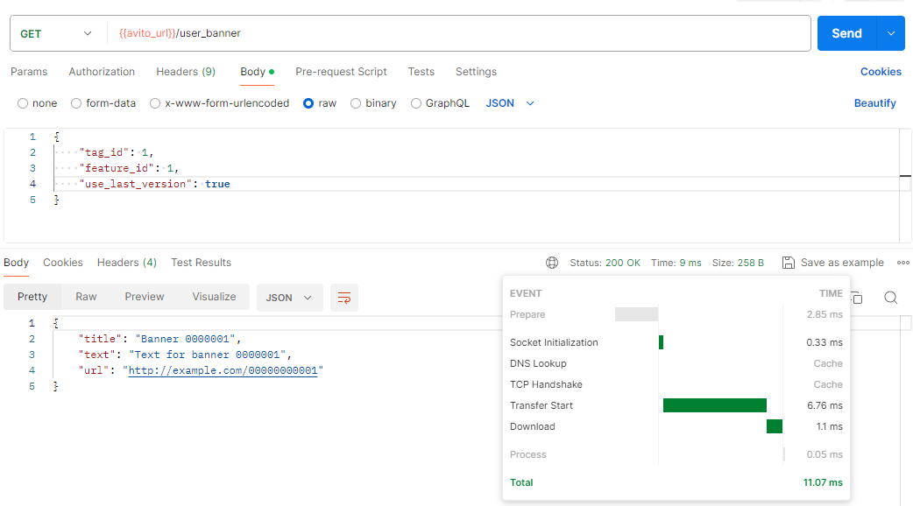
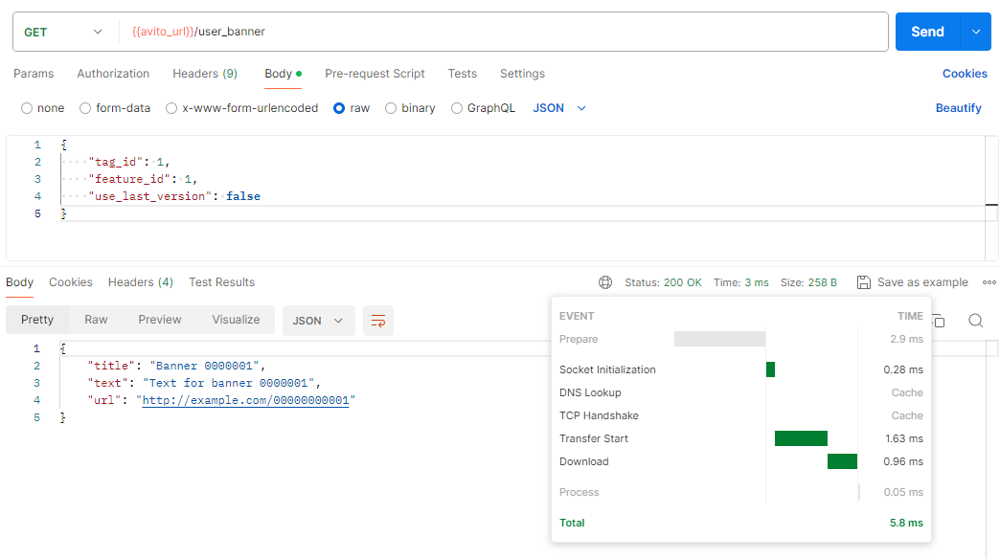
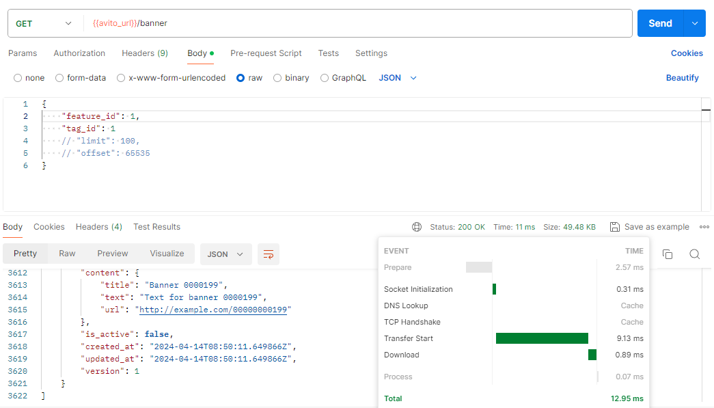
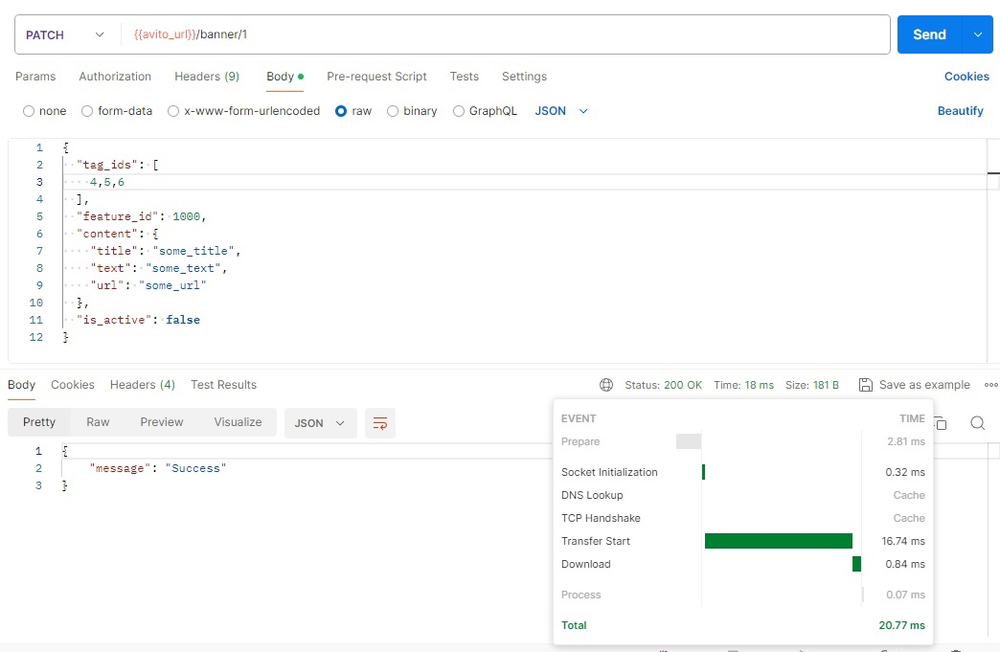
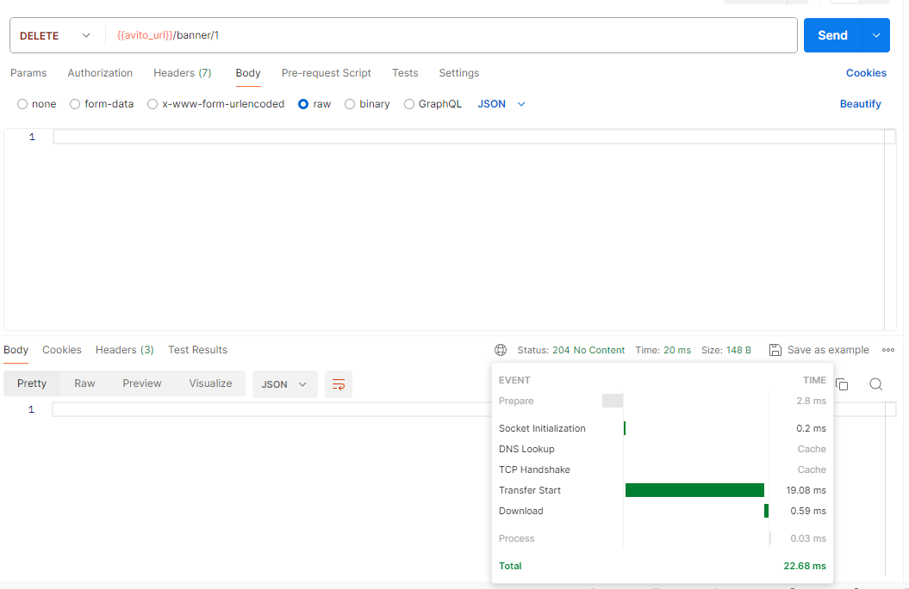
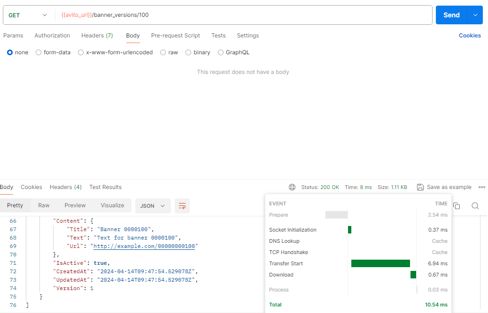
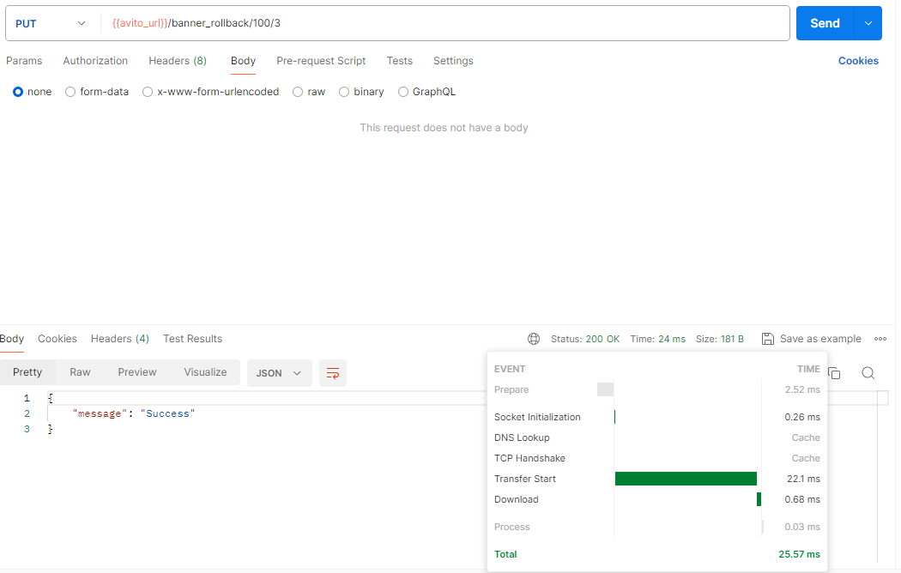

# О сервисе

У сервиса семь ручек, шесть из которых способны дергать только админы
1. [Get]  /user_banner = находим уникальный баннер по фиче и тэгу
2. [Get]  /banner = находим баннеры по фильтру
3. [Post]  /banner = добавляем баннер
4. [Patch]  /banner/:banner_id = обновляем содержимое баннера с :banner_id
5. [Delete]  /banner/:banner_id = удаляем баннер с :banner_id
6. [Get]  /banner_versions/:banner_id = получаем основную и последние 3 версии баннера с :banner_id
7. [Put]  /banner_rollback/:banner_id/:version = откатываем баннер с :banner_id к версии :version

# Подробнее о ручках

### 1) [Get]  /user_banner Пользовательская

Содержимое запроса:
```
TagId          models.TagId     `json:"tag_id" validate:"required"`
FeatureId      models.FeatureId `json:"feature_id" validate:"required"`
UseLastVersion bool             `json:"use_last_version"`
```
Содержимое ответа:
```
Title string `json:"title"`
Text  string `json:"text"`
Url   string `json:"url"`
```

Производительность на 1000 записей, если брать запись из postgreSQL



Производительность, если брать из редиса



### 2) [Get]  /banner Админская

Содержимое запроса:
```
FeatureId *models.FeatureId `json:"feature_id"`
TagId     *models.TagId     `json:"tag_id"`
Limit     *int              `json:"limit"`
Offset    *int              `json:"offset"`
```
Содержимое ответа каждого элемента массива:
```
BannerId  models.BannerId  `json:"banner_id"`
TagIds    []models.TagId   `json:"tag_ids"`
FeatureId models.FeatureId `json:"feature_id"`
Content   struct {
    Title string `json:"title"`
    Text  string `json:"text"`
    Url   string `json:"url"`
} `json:"content"`
IsActive  bool      `json:"is_active"`
CreatedAt time.Time `json:"created_at"`
UpdatedAt time.Time `json:"updated_at"`
Version   int64     `json:"version"`
```
Производительность на 1000 записей, если мы хотим получить в итоге 200 записей



### 3) [Post]  /banner Админская

Содержимое запроса:
```
TagIds    []models.TagId   `json:"tag_ids" validate:"required"`
FeatureId models.FeatureId `json:"feature_id" validate:"required"`
Content   struct {
    Title string `json:"title" validate:"required"`
    Text  string `json:"text" validate:"required"`
    Url   string `json:"url" validate:"required"`
} `json:"content"`
IsActive bool `json:"is_active"`
```
Содержимое ответа:
```
BannerId models.BannerId `json:"banner_id"`
```
Производительность


### [Patch] 4) /banner/:banner_id Админская

Содержимое запроса:
```
Загаловок:
BannerId models.BannerId `:banner_id`
Тело:
TagIds    *[]models.TagId   `json:"tag_ids"`
FeatureId *models.FeatureId `json:"feature_id"`
Content   *struct {
    Title *string `json:"title"`
    Text  *string `json:"text"`
    Url   *string `json:"url"`
} `json:"content"`
IsActive *bool `json:"is_active"`
```
Содержимое ответа:
```
Message string `json:"message"`
```
Производительность



### [Delete] 5) /banner/:banner_id Админская

Содержимое запроса:
```
Загаловок:
BannerId models.BannerId `:banner_id`
```
Производительность



### [Get] 6) /banner_versions/:banner_id Админская

Содержимое запроса:
```
Загаловок:
BannerId models.BannerId `:banner_id`
```
Содержимое ответа каждого элемента массива:
```
BannerId  models.BannerId  `json:"banner_id"`
TagIds    []models.TagId   `json:"tag_ids"`
FeatureId models.FeatureId `json:"feature_id"`
Content   struct {
    Title string `json:"title"`
    Text  string `json:"text"`
    Url   string `json:"url"`
} `json:"content"`
IsActive  bool      `json:"is_active"`
CreatedAt time.Time `json:"created_at"`
UpdatedAt time.Time `json:"updated_at"`
Version   int64     `json:"version"`
```
Производительность на 4 версиях



### [Put] 7) /banner_rollback/:banner_id/:version Админская

Содержимое запроса:
```
Загаловок:
BannerId models.BannerId `:banner_id`
Version int64 `:version`
```
Содержимое ответа:
```
Message string `json:"message"`
```
Производительность

