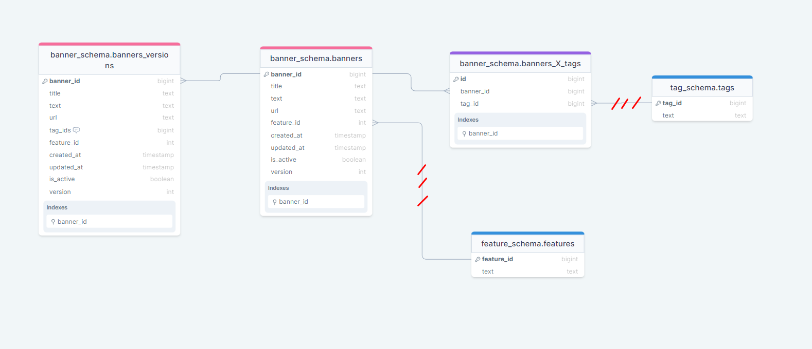

# Реляции

Структура 3 таблиц:
- Баннеры = связаны с тэгами (manyToMany), 'с фичами' (manyToOne), с версиямии (oneToMany)
- Баннеры_x_Тэги = manyToMany связь между баннерами и тэгами
- Версии = связаны с баннерами (manyToOne)
- 'Тэги' = связаны с баннерами (manyToMany)
- 'Фичи' = связаны с баннерами (oneToMany)

Таблицы с фичами и тэгами не прописаны, но по заданию айдишники к ним ссылаются

    1) Почему версии отделены от баннеров, когда их колонки чуть ли ни идентичные

Цель вопроса проста, я хочу узнать можно ли было денормализовать базу в лучшую сторону, учитывая, что я добавил версии после того
как написал баннеры и баннеры_X_тэги. Я могу привести аргументы за, так и обломать их
- В версиях, есть колонка tag_ids, которая в баннерах содержится в таблице manyToMany (Не аргумент наверное, ведь в баннеры ее тоже можно было добавить, просто всегда держать пустой)
- В ручках patch + delete мы обращаемся к banner_id и было бы хорошо, если бы баннеры были уникальными и не были засорены версиями (Не аргумент, ведь фронт точно смог бы нам нормально
как то показать айдишники, чтобы нам было удобно к ним обращаться)

Я догадываюсь, что было бы лучше объединить их, но тогда нужно переписывать запросы getMany и getOne, чтобы они получали самые новые баннеры.
Звучит как несложная задача, но не уверен как это повлияет на производительность, ведь нам придется делать некую max сортировку внутри sql. + 
Времени на денормализацию не хватает, ведь как и большинство кандидатов над проектом удавалось работать только в выходные.

    2) Стоило ли было убрать manyToMany связь с тэгами и добавить хранение тэгов в виде массива в баннере

Думаю точно не стоит, использование массивов для хранения ссылок на другие строки может усложнить запросы и манипуляции с данными, 
и может не быть эффективным для больших объемов данных или для запросов, требующих индексирования или сложных операций соединения.
Ну и я не особо знаю как можно было повесить на массив foreign_key, чтобы валидировать, что тэг существует.

    3) Ужасная валидация уникальности фичи + тэга к одному баннеру

Sql способен сам следить за уникальностью записей, но дело в том, что навесить это ограничение на записи, находящихся в разных таблицах нельзя?
По крайней мере мне не удалось найти ресурса на эту тему. Можно было решить эту проблему непринужденно, добавив в связь manyToMany feature_id и 
потом навесить ограничение, ведь теперь связка находится в одной таблице. Аргумент против / за:
- Против: Это приводит к дупликации данных feature_id (не в том плане, что она будет и в баннерах и в баннерах_X_тэги, а в том что
в таблице баннерах_X_тэги мы будем видеть записи, например {banner_id, tag_id, feature_id} = {1, 1, 1},{1, 2, 1},{1, 3, 1},{1, 4, 1}, которые имеют в 
себе всегда одинаковый feature_id в рамках одного баннера, но многих tag_id)
- За: Сильно упрощает логику, освобождает время, делает код читабельным (Если посмотреть мою Patch функцию в юзкейсе, то заметно, насколько ее тяжело осознать с первого раза)

    4) Очень удобно полагаться на sql в многих вещах  

Я не уверен в том как сильно стоит полагаться на sql в валидации данных, например, ставить sql проверку, что к одному баннеру могут 
быть прикреплены только один уникальный тэг или фича (чтобы не было дубликатов, что к одному баннеру идет 100 одинаковых тэгов) = сильно загружать?
Поэтому валидацию на повторяющиеся данные я оставил свою, целесообразно?

